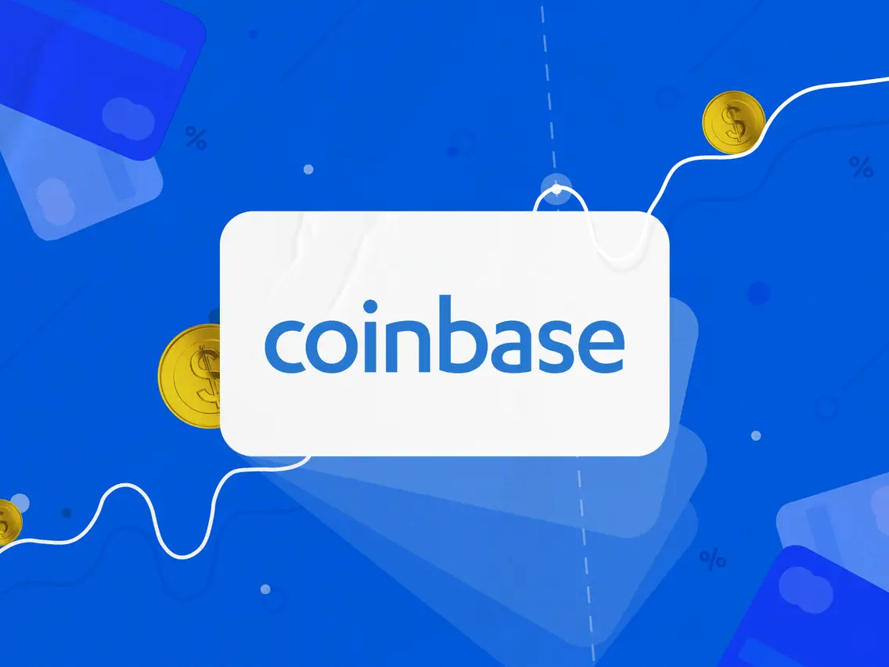

# Coinbase Case Study:

## Alternative Finance - Cryptocurrency / Payment Services

* When was the company incorporated?

    -   Coinbase was established in 2012 by Brian Armstrong and Fred Ehrsam.

* How did the idea for the company come about?

    -   Brian always wanted to be a successful entrepreneur. From a young age he set wild career goals to chase, the wildest being be the founder of a billion dollar company. This initial product offering only consisted of a Coinbase Cryptocurrency Wallet.

* How is the company funded? How much funding have they received?

    -   The company was granted a $150,000 USD start-up grant from Y Combinator back in 2012. 
    -   In May 2013 another $5,000,000U USD was granted in a series A by Fred Wilson from Union Square Ventures. 
    -   In December 2013 Andreessen Horowitz granted them an additional $25,000,000 USD.
    -   In January 2015 they received $75,000,000 USD from Draper Fisher Jurvetson and several other banks.

## Business Activities

* What specific financial problem is the company or project trying to solve?

    -   The company wanted to be one of the first regulated and trusted cryptocurrency wallet for users in the United States. Large adoption of their services spurred them onto include the purchase and sale of bitcoins directly through bank transfers.
    -   In January 2015 they launched a bitcoin exchange called Coinbase Exchange. This expanded to Singapore and Canada later that year.
    -   Subsequently they increased the asset offerings on both their wallet and exchange whilst largely increasing the size of their company and its market capitalisation. 

* Who is the company's intended customer?  Is there any information about the market size of this set of customers?

    -   Currently Coinbase has expanded its operations to most of the developed world, with a userbase of around 43 million as reported to the SEC.
    -   It is involved with 7,000 in more than 100 countries. The intended customer is any person who wishes to have financial freedom through the use of cryptocurrency.-  It is limited to the jurisdictions they are allowed to operate in.

* What solution does this company offer that their competitors do not or cannot offer? 

    -   Coinbase offers the highest level of security and trust regarding their operations relative to all its competitors offerings. 
    -   This is largely due to the stringent regulations imposed by the SEC and other regulatory bodies in the United States. 
    -   They do have an advantage being the first mover to offer professional custodial services in a trustworthy manner. 
    -   Additionally, due to their economies of scale they have the ability to charge lower fees that competing products and services. 

* Which technologies are they currently using, and how are they implementing them? 

    -   They currently have separate product offering to retail customers and institutional clients.

   

    

    For the retail consumers:

        - Coinbase an application to view and control their funds and assets

        - Coinbase Pro, a professional trading platform

        - Coinbase wallet, a decentralised application that plugs into web3

        - Coinbase NFT which is a marketplace to collect and trade non-fungible tokens

    

    For the institutions:

        - Coinbase Prime, a trading platform

        - Coinbase custody, a service that enables coinbase to securely hold assets on behalf of clients

    Other products:

        - USD Coin, coinbase's own stablecoin

        - Coinbase Card which is a VISA card allowing the spending of cryptocurrency

        - Coinbase Earn, a staking service of yield generation for the customer to use their assets 

## Landscape

* What domain of the financial industry is the company in?

    -   Coinbase operates in both the payment services domain, whilst predominantly a set of cryptocurrency platforms that enable retail consumers and institutions to trade and store cryptocurrencies.

* What have been the major trends and innovations of this domain over the last 5–10 years?

    -   The major trends have been the expansion of product offers and assets available to be traded. Coinbase only allows trusted and sufficiently decentralised assets on their platform. However, despite this barrier to entry it still offers more than 100 assets.

* What are the other major companies in this domain?

    -   Its main competitors are other exchanges such as FTX, Binance and Kracken. 
    -   There are dozens of other mid-tier exchanges that also consolidate a fair chunk of market share such as Kucoin, Gate.io, OKX, Huobi and the list goes on.

## Results

* What has been the business impact of this company so far?

    -   It has enabled risk-averse investors the ability to trade and hold cryptocurrency assets in a safer, more transparent way. 
    -   Until the dawn of Coinbase there were little safeguards to protect customers from exploits, hacks and scams. 

* What are some of the core metrics that companies in this domain use to measure success? How is your company performing, based on these metrics?

    -   As Coinbase is in a league of its own it has recently become a publicly traded company. This means it bases its success on both the traditional sense such as earnings, revenue and bottom line growth.
    -   As the majority of its competitors are privately owned and operated the financial statements and information available is hard to locate or estimate. 
    -    Due to this fact other metrics used can be visits to the site, volume traded and other unique metrics such as trust scores. Such trust scores are generated by cryptocurrency glossaries such as CoinGecko or CoinMarketCap.

* How is your company performing relative to competitors in the same domain?

    -   Using the cryptocurrency based performance metrics, Coinbase is 2nd in relation to volume transacted losing only to Binance. 
    -   Binance is a mammoth on a relative bases with a 24H trading volume of $14,905,509,449 as of 18/08/2022 whilst Coinbase transacted $2,064,791,112 over the same period.

    -   Using clicks per day, Coinbase is further down the list around 20th, however this metric has been known to be questionable as wash-trading and bots are rife in this industry. 
    
    -   Lastly is the trust score. Utilising CoinGecko's metric, Coinbase scores a 10/10  which is shares with 13 other exchange providers. 

## Recommendations

* If you were to advise the company, what products or services would you suggest they offer? 

    -   Coinbase has expanded its offerings considerably over its 10 year span.
    However, I would suggest they include educational content for users to become savvy with their understanding in the domain. As the industry is targeted more than any other with scams and fraudulent activity it is wise to equip users with the ability to safeguard their wealth. 

* Why do you think that offering this product or service would benefit the company?

    -   This would give Coinbase an increased reputation in relation to their ability to look after their users. 
    -   It would also highlight the company as one who can be trusted with their funds. -   It could also be a one stop shop for new users to get exposure to cryptocurrency without having to risk their capital with potentially insolvent or untrustworthy exchanges or wallets.

* What technologies would this additional product or service utilise?

    -   This could be incorporated into their desktop and mobile applications to allow ease of use for their customers. 
    -   They could also have a service that mimics how to spot fraudulent offerings or activity so that users are aware of how to spot and dismiss them. 
    -   This could be in the form of a demo accounts that operate in much the same way as the real counterparts which would train and develop the users with the somewhat confusing operations of transferring, purchasing or holding cryptocurrency applications.

* Why are these technologies appropriate for your solution?

    -   This technology is required to give consumers experience with the confusing and intricate art of transferring funds across from different blockchains, address and wallets. By offering the hands on learning the customer could then trust their judgement when going through the motions with their actual assets. 

